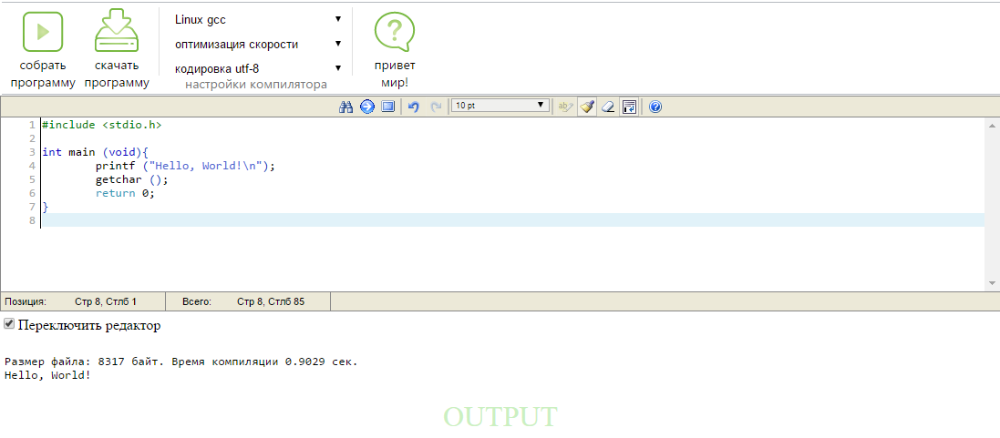

# c-online-microIDE

Простая онлайн IDE с компиляцией на стороне сервера.
В текущем виде требует сервер с Linux и компиляторами GCC и MinGW32
Рекомендуется к установке только на домашнем сервере, т.к. скомпилированные программы запускаются не в песочнице, или необходимо удалить из скрипта возможность запуска.

Использованы иконки из набора Super Mono Basic и подсветка синтаксиса Editarea 0.8.2
Основано на [localhost-C-IDE-Web](https://github.com/zed41/localhost-C-IDE-Web)